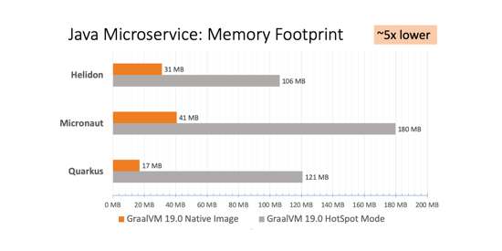

GraalVM workshop for Reliance group, India

Table of Contents:

* [Exercise 1: Requirements](#exercise-1-requirements)
* [Exercise 2: GraalVM Enterprise](#exercise-2-graalvm-enterprise)
* [Exercise 3: Microservices](#exercise-3-microservices)
* [Exercise 4: SpringBoot](#exercise-4-springboot)

# Exercise 1: Requirements

In order to get yourself ready for this workshop, you need to prepare your machine/laptop to have the following requirements.

  * Supported OS is MacOS and Linux. Windows is supported by GraalVM but for this workshop we do not use Windows. This hands-on labs exercise have been tested with Ubuntu 20.04, Fedora 32 (with minor tweak due to CGroup v2 issue - see the workaround at the later part of this hands-on labs) and MacOS 10.15.6.
  * Install the following tools : git, curl, unzip, docker, maven and your favourite IDE.
  * Internet connection. You will need to access some online Github repositories during workshop exercises.
  * Uninstall any JDK/OpenJDK that comes with the OS. Example Fedora 32 comes with OpenJDK 8.
    * On Fedora 32 execute ```sudo rpm -qa | grep java``` or ```sudo rpm -qa | grep jdk```, the output is something like (could be different from your machine) ```java-1.8.0-openjdk.x86_64``` and    uninstall using ```sudo yum remove java-1.8.0-openjdk.x86_64```.

# Exercise 2: GraalVM Enterprise

There are a lot of different parts to GraalVM, so while you may have heard of it, there are almost certainly things that it can do that you don't know about yet. In this workshop we'll go through some of the diverse features of GraalVM and show you what they can do for you.

In this workshop we will be using GraalVM Enterprise Edition 20.1.0 for JDK 8 which can be downloaded from [OTN - Oracle Technology Network](https://www.oracle.com/downloads/graalvm-downloads.html)

## 1. Setup GraalVM Enterprise Edition

Below are the steps to setup **GraalVM Enterprise Edition 20.1.0 for JDK 8**.

* a) In order to get started with GraalVM Enterprise Edition, you will need to download it from [OTN - Oracle Technology Network](https://www.oracle.com/downloads/graalvm-downloads.html), make sure to choose "GraalVM Enterprise Edition 20 Current Release" tab as seen from below picture.

  

* b) Select Release Version 20.1.0, Java Version 8, and your OS (operating system) type.
If you are using MacOS (like I do), you can choose macOS for the OS. Another supported OS is Windows and Linux.
For this workshop we are only use either macOS or Linux. Windows has lesser features right now, therefore we don't use it now.

  

* c) Once you selected the OS, you can download 3 GraalVM components from OTN.

  1.  Oracle GraalVM Enterprise Edition Core
  2.  Oracle GraalVM Enterprise Edition Native Image
  3.  GraalVM LLVM Toolchain Plugin

  Beside the above 3 components we also need _GraalVM R Language Plugin_ component for this workshop.

  You can't download _GraalVM R Language Plugin_ from OTN, but you can install it online using ```gu``` utility.

  We will install it at later part of this workshop material.

  
  Optionally, you can also download Oracle GraalVM Enterprise Edition Python Language Plugin, Oracle GraalVM Enterprise Edition Ruby Language Plugin and Oracle GraalVM Enterprise Edition WebAssembly Language Plugin. But they are not required for this workshop.

   You need to login to OTN to be able to download the binaries. If you have an existing Oracle credential you can use it, but if not you can create one as seen from the following picture.

  

* d) Once downloaded successfully, you can extract it out using below commands

  * On MacOS

    
    >```sh
    >tar -zxf graalvm-ee-java8-darwin-amd64-20.1.0.tar.gz
    >```

  * On Linux

     
     >```sh
     >tar -zxf graalvm-ee-java8-linux-amd64-20.1.0.tar.gz
     >```

* e) It will a new directory named "graalvm-ee-java8-20.1.0". Move it to any path that you want for example for MacOS I used to put it under ```/Library/Java/JavaVirtualMachines/```, or on Linux you can put it under ```/opt/```. This is will become your GraalVM installation directory.

  * On MacOS

    
    >```sh
    >sudo mv graalvm-ee-java8-20.1.0 /Library/Java/JavaVirtualMachines/.
    >```

    So, your GraalVM installation directory on MacOS is ```/Library/Java/JavaVirtualMachines/graalvm-ee-java8-20.1.0/Contents/Home```

  * On Linux

     
     >```sh
     >sudo mv graalvm-ee-java8-20.1.0 /opt/.
     >```

     And then your GraalVM installation directory on Linux is ```/opt/graalvm-ee-java8-20.1.0```

* f) Modify your terminal shell accordingly. Open your terminal and based on your shell type bash/zsh do the following.

  * On MacOS

    

    for zsh:
    >```sh
    > vi ~/.zshrc
    >```

    for bash:
    >```sh
    > vi ~/.bashrc
    >```

    and add the following to ```~/.zshrc``` or ```~/.bashrc``` files:

    >```sh
    >export GRAALVM_HOME=/Library/Java/JavaVirtualMachines/graalvm-ee-java8-20.1.0/Contents/Home
    >export PATH=$PATH:$GRAALVM_HOME/bin
    >```

    Save it, and then source using the following command:

    

    for zsh:
    >```sh
    > source ~/.zshrc
    >```

    for bash:
    >```sh
    > source ~/.bashrc
    >```

  * On Linux

    The same steps like MacOS above, except the ```GRAALVM_HOME``` directory is slightly different

    
    >```sh
    >export GRAALVM_HOME=/opt/graalvm-ee-java8-20.1.0
    >export PATH=$PATH:$GRAALVM_HOME/bin
    >```

    Save it, and source it (see the above MacOS step).

* g) That's it. You have just installed GraalVM on your MacOS or Linux machine. Next 2 steps are verifying the GraalVM installation and then setup Native Image, LLVM toolchain and R components.

* h) Verifying GraalVM installation.

  You can verify that the GraalVM versions will be used with the following commands:

  
  >```sh
  >java -version
  >```

  Should output:

  ```
  java version "1.8.0_251"
  Java(TM) SE Runtime Environment (build 1.8.0_251-b08)
  Java HotSpot(TM) 64-Bit Server VM GraalVM EE 20.1.0 (build 25.251-b08-jvmci-20.1-b02, mixed mode)
  ```

  Verify GraalVM JavaScript version

  
  >```sh
  >js --version
  >```

  Should output:

  ```
  GraalVM JavaScript (GraalVM EE Native 20.1.0)
  ```

  
  >```sh
  >$GRAALVM_HOME/bin/node --version:graalvm
  >```

  Should output:

  ```
  GraalVM EE Native Polyglot Engine Version 20.1.0
  Java Version 1.8.0_251
  Java VM Version GraalVM 20.1.0 Java 8 EE
  GraalVM Home /Library/Java/JavaVirtualMachines/graalvm-ee-java8-20.1.0/Contents/Home
    Installed Languages:
      JavaScript version 20.1.0
      LLVM       version 20.1.0
    Installed Tools:
      Agent Script            version 0.6
      Code Coverage           version 0.1.0
      CPU Sampler             version 0.4.0
      CPU Tracer              version 0.3.0
      Heap Allocation Monitor version 0.1.0
      Insight                 version 0.6
      Chrome Inspector        version 0.1
      Language Server         version 0.1
      Memory Tracer           version 0.2
  ```

  GraalVM Utility (gu) version

  
  >```sh
  >gu --version
  >```

  Should output:

  ```
  GraalVM Updater 20.1.0
  ```

* i) The final step of the setup is to install Native Image, LLVM toolchain, and R using GraalVM Utility ```gu```

   * On MacOS / Linux

      Assuming your default download directory is ```~/Downloads/```, you can run the following commands:

    
    >```sh
    >gu install -L ~/Downloads/native-image-installable-svm-svmee-java8-darwin-amd64-20.1.0.jar
    >gu install -L ~/Downloads/llvm-toolchain-installable-java8-darwin-amd64-20.1.0.jar
    >gu install R
    >```

    Test it with the following command:

    
    >```sh
    >gu list
    >```

    Should output:

    ```
    ComponentId              Version             Component name      Origin
    --------------------------------------------------------------------------------
    graalvm                  20.1.0              GraalVM Core
    R                        20.1.0              FastR               github.com
    llvm-toolchain           20.1.0              LLVM.org toolchain  
    native-image             20.1.0              Native Image
    ```    

    **Configure FastR**

    After installing FastR component using ```gu install R``` which will download R binary file from github, you are encourage to configure it.
    Below is how you do it on MacOS and Linux:

    On Linux

    
    >```sh
    >/opt/graalvm-ee-java8-20.1.0/jre/languages/R/bin/configure_fastr
    >```

    On MacOS

    
    >```sh
    >/Library/Java/JavaVirtualMachines/graalvm-ee-java8-20.1.0/Contents/home/jre/languages/R/bin/configure_fastr
    >```

    The output is something like the following:

    On Linux

    ```
    The basic configuration of FastR was successfull.

    Note: if you intend to install R packages you may need additional dependencies.
    The following packages should cover depenedencies of the most commonly used R packages:
    On Debian based systems: apt-get install build-essential gfortran libxml2 libc++-dev
    On Oracle Linux: yum groupinstall 'Development Tools' && yum install gcc-gfortran

    Default personal library directory (/home/mluther/R/x86_64-pc-linux-gnu-library/fastr-20.1.0-3.6) does exist. Do you wish to create it? (Yy/Nn) y
    Creating personal library directory: /home/mluther/R/x86_64-pc-linux-gnu-library/fastr-20.1.0-3.6
    DONE

    ```

    On MacOS

    ```
    The basic configuration of FastR was successfull.

    Note: if you intend to install R packages you may need additional dependencies.
    The most common dependency is GFortran, which must be of version 8.3.0 or later.
    See https://gcc.gnu.org/wiki/GFortranBinaries.
    If the 'gfortran' binary is not on the system path, you need to configure the full path to it in /Library/Java/JavaVirtualMachines/graalvm-ee-java8-20.1.0/Contents/home/jre/languages/R/etc/Makeconf (variable FC)

    Default personal library directory (/Users/mluther/R/x86_64-apple-darwin-library/fastr-20.1.0-3.6) does exist. Do you wish to create it? (Yy/Nn) y
    Creating personal library directory: /Users/mluther/R/x86_64-apple-darwin-library/fastr-20.1.0-3.6
    DONE
    ```

    **Native Image prerequisite**

    Native Image requires ```glibc-devel, zlib-devel, and gcc``` libraries as seen [here](https://docs.oracle.com/en/graalvm/enterprise/19/guide/reference/native-image/native-image.html#prerequisites) to be installed on your MacOS or Linux machine. You can install those libraries using package manager available in your OS.

    **Oracle Linux** using ```yum``` package manager

    
    >```sh
    >sudo yum install gcc glibc-devel zlib-devel
    >```

    **Ubuntu Linux** using ```apt-get``` package manager

    
    >```sh
    >sudo apt-get install build-essential libz-dev zlib1g-dev
    >```

    **Other Linux** using ```rpm``` package manager

    
    >```sh
    >sudo dnf install gcc glibc-devel zlib-devel libstdc++-static
    >```

    **MacOS**

    
    >```sh
    >xcode-select --install
    >```

    Congratulation! You have successfully installed GraalVM Enterprise Edition along with its Native Image, LLVM toolchain, and R components.

    Next, we will be running some application on GraalVM Enterprise.

## 2. High-performance modern **JIT compiler** for Java.

GraalVM in general can be ran in 2 different modes, first as a pure _**JIT compiler**_, and the other as _**AOT (Ahead-of-Time) compiler**_.

We will try out GraalVM AOT at the later part of this workshop, but now let's drill into *JIT compiler and how it can help to boost application performance*.

**:: Graal JIT ::**

In this exercise, we'll be using materials from the following article:
https://medium.com/graalvm/graalvm-ten-things-12d9111f307d

The simplified version of the source code repository can be found in this [Github repo](https://github.com/marthenlt/native-image-workshop).

You can simply clone the source code by using this command:


>```sh
>git clone https://github.com/marthenlt/native-image-workshop.git
>```

Once you've cloned the above repo you can then change directory to ```native-image-workshop``` and unzip ```large.zip``` file. See the following commands:


>```sh
>cd native-image-workshop
>unzip large.zip
>```

So if you do ```ls -al``` the output of your working directory is something like this :

```
drwxr-xr-x  12 mluther  staff        384 Aug 10 20:57 .
drwxr-xr-x   7 mluther  staff        224 Aug 10 20:52 ..
drwxr-xr-x  14 mluther  staff        448 Aug 10 20:59 .git
-rw-r--r--   1 mluther  staff         33 Aug 10 20:04 .gitignore
-rw-r--r--   1 mluther  staff        545 Aug 10 20:04 README.md
-rw-r--r--   1 mluther  staff       1127 Aug 10 20:04 TopTen.java
-rw-r--r--   1 mluther  staff         81 Aug 10 20:04 c2.sh
-rw-r--r--   1 mluther  staff         59 Aug 10 20:04 graal.sh
-rwxr-xr-x   1 mluther  staff  151397500 Sep 20  2019 large.txt
-rw-r--r--   1 mluther  staff   40230188 Aug 10 20:04 large.zip
-rw-r--r--   1 mluther  staff       1024 Aug 10 20:57 small.txt
-rw-r--r--   1 mluther  staff         55 Aug 10 20:04 timer.bat
```

We'll use ```TopTen.java``` example program, which gives you the top-ten words in ```large.txt``` file (file size is round 150 MB).
It uses Stream Java API to traverse, sort and count all the words (total there are 22,377,500 words).

Below is the TopTen.java program looks like:

```java
import java.io.IOException;
import java.nio.file.Files;
import java.nio.file.Paths;
import java.util.Arrays;
import java.util.function.Function;
import java.util.stream.Collectors;
import java.util.stream.Stream;

public class TopTen {

    public static void main(String[] args) {
        Arrays.stream(args)
                .flatMap(TopTen::fileLines)
                .flatMap(line -> Arrays.stream(line.split("\\b")))
                .map(word -> word.replaceAll("[^a-zA-Z]", ""))
                .filter(word -> word.length() > 0)
                .map(word -> word.toLowerCase())
                .collect(Collectors.groupingBy(Function.identity(), Collectors.counting()))
                .entrySet().stream()
                .sorted((a, b) -> -a.getValue().compareTo(b.getValue()))
                .limit(10)
                .forEach(e -> System.out.format("%s = %d%n", e.getKey(), e.getValue()));
    }

    private static Stream<String> fileLines(String path) {
        try {
            return Files.lines(Paths.get(path));
        } catch (IOException e) {
            throw new RuntimeException(e);
        }
    }

}
```

**:: Graal JIT - _Compile The TopTen.java Program_ ::**

GraalVM includes a `javac` compiler, but it isn't any different from the
standard one for the purposes of this demo, so you could use your system `javac`
instead if you wanted to.

To compile use the following command:


>```sh
> javac TopTen.java
>```

If we run the `java` command included in GraalVM we'll be automatically using
the GraalVM JIT compiler - no extra configuration is needed. I'll use the `time`
command to get the real, wall-clock elapsed time it takes to run the entire
program from start to finish, rather than setting up a complicated
micro-benchmark.

Use below command to measure how long GraalVM Enterprise can finished running TopTen.java


>```sh
> time java TopTen large.txt
>```

The output looks like the following, but the speed is really depends on your machine/laptop.

On Linux

```
sed = 502500
ut = 392500
in = 377500
et = 352500
id = 317500
eu = 317500
eget = 302500
vel = 300000
a = 287500
sit = 282500

real	0m21.411s
user	0m30.780s
sys	0m1.224s
```

On MacOS (on my MacOS machine)

```
sed = 502500
ut = 392500
in = 377500
et = 352500
id = 317500
eu = 317500
eget = 302500
vel = 300000
a = 287500
sit = 282500
java TopTen large.txt  11.62s user 0.49s system 114% cpu 10.535 total
```

GraalVM is written in Java, rather than C++ like most other JIT compilers for
Java. We think this allows us to improve it more quickly than existing
compilers, with powerful new optimisations such as partial escape analysis that
aren't available in the standard JIT compilers for HotSpot. This can make your
Java programs run significantly faster.

To run without the GraalVM JIT compiler to compare, we can use the flag
`-XX:-UseJVMCICompiler`. JVMCI is the interface between GraalVM and the JVM. You
could also compare against your standard JVM as well.


>```sh
> time java -XX:-UseJVMCICompiler TopTen large.txt
>```

On Linux

```
sed = 502500
ut = 392500
in = 377500
et = 352500
id = 317500
eu = 317500
eget = 302500
vel = 300000
a = 287500
sit = 282500

real	0m32.080s
user	0m32.719s
sys	0m0.490s
```

On MacOS (on my MacOS machine)

```
sed = 502500
ut = 392500
in = 377500
et = 352500
id = 317500
eu = 317500
eget = 302500
vel = 300000
a = 287500
sit = 282500
java -XX:-UseJVMCICompiler TopTen large.txt  15.91s user 0.30s system 106% cpu 15.282 total
```

This shows GraalVM running our Java program in around two-thirds of the
wall-clock (`real`) time it takes to run it with a standard HotSpot compiler. In
an area where we are used to treating single-digit percentage increases in
performance as significant, this is a big-deal.

You'll still get a result better than HotSpot if you use the Community
Edition, but it won't be quite as a good as the Enterprise Edition.

Twitter is one company [using GraalVM in production
today](https://www.youtube.com/watch?v=OSyvidFXL7M), and they say that for them
it is paying off in terms of real money saved. Twitter are using GraalVM to run
Scala applications - GraalVM works at the level of JVM bytecode so it works for
any JVM language.

This is the first way you can use GraalVM - simply as a drop-in better JIT
compiler for your existing Java applications.


## 2. Ahead-of-Time (AOT) Compiler for Java Bytecode

We have learned from previous exercise that GraalVM Enterprise can boost Java program performance without changing any code.

In the next exercise, we will be using GraalVM Native Image to Ahead-of-Time compile Java Bytecode into a native binary executable file.

**:: Graal AOT ::**

The Java platform is particularly strong for long-running processes and peak
performance, but short-running processes can suffer from longer startup time and
relatively high memory usage.

For example, if we run the same application with a much smaller input text file called ```small.txt``` - around 1 KB instead of 150 MB,
then it seems to take an unreasonably long time, and quite a lot of memory at 70 MB, to run for such a small file. We use `-l` to print the
memory used as well as time used.


>```sh
> /usr/bin/time -v java TopTen small.txt   # -l on Mac instead of -v
>```

```
sed = 6
sit = 6
amet = 6
mauris = 3
volutpat = 3
vitae = 3
dolor = 3
libero = 3
tempor = 2
suscipit = 2
	Command being timed: "java TopTen small.txt"
	User time (seconds): 0.39
	System time (seconds): 0.04
	Percent of CPU this job got: 168%
	Elapsed (wall clock) time (h:mm:ss or m:ss): 0:00.26
	Average shared text size (kbytes): 0
	Average unshared data size (kbytes): 0
	Average stack size (kbytes): 0
	Average total size (kbytes): 0
	Maximum resident set size (kbytes): 76116
...
```

GraalVM gives us a tool that solves this problem. We said that GraalVM is like a
compiler library and it can be used in many different ways. One of those is to
compile *ahead-of-time*, to a native executable image, instead of compiling
*just-in-time* at runtime. This is similar to how a conventional compiler like
`gcc` works.

**:: Graal AOT - _Creating Binary Executable Using Native Image_::**

Now let's creating our first binary executable file using GraalVM Native Image from an existing TopTen bytecode.
Execute below command to create a TopTen's native binary executable:


>```sh
> native-image --no-server --no-fallback TopTen
>```

The output is something like the following:

```
[topten:37970]    classlist:   1,801.57 ms
[topten:37970]        (cap):   1,289.45 ms
[topten:37970]        setup:   3,087.67 ms
[topten:37970]   (typeflow):   6,704.85 ms
[topten:37970]    (objects):   6,448.88 ms
[topten:37970]   (features):     820.90 ms
[topten:37970]     analysis:  14,271.88 ms
[topten:37970]     (clinit):     257.25 ms
[topten:37970]     universe:     766.11 ms
[topten:37970]      (parse):   1,365.29 ms
[topten:37970]     (inline):   3,829.55 ms
[topten:37970]    (compile):  34,674.51 ms
[topten:37970]      compile:  41,412.71 ms
[topten:37970]        image:   2,741.41 ms
[topten:37970]        write:     619.13 ms
[topten:37970]      [total]:  64,891.52 ms
```

This command produces a native executable called `topten`. This executable isn't
a launcher for the JVM, it doesn't link to the JVM, and it doesn't bundle the
JVM in any way. `native-image` really does compile your Java code, and any Java
libraries you use, all the way down to simple machine code. For runtime
components like the garbage collector we are running our own new VM called the
SubstrateVM, which like GraalVM is also written in Java.

If we look at the libraries which `topten` uses you can see they are only
standard system libraries. We could also move just this one file to a system
which has never had a JVM installed and run it there to verify it doesn't use a
JVM or any other files. It's also pretty small - this executable is less than 8
MB.


>```sh
> ldd topten    # otool -L topten on Mac
>```

```
	linux-vdso.so.1 =>  (0x00007ffe1555b000)
	libm.so.6 => /lib64/libm.so.6 (0x00007f6bda7c6000)
	libpthread.so.0 => /lib64/libpthread.so.0 (0x00007f6bda5aa000)
	libdl.so.2 => /lib64/libdl.so.2 (0x00007f6bda3a6000)
	libz.so.1 => /lib64/libz.so.1 (0x00007f6bda190000)
	librt.so.1 => /lib64/librt.so.1 (0x00007f6bd9f88000)
	libcrypt.so.1 => /lib64/libcrypt.so.1 (0x00007f6bd9d51000)
	libc.so.6 => /lib64/libc.so.6 (0x00007f6bd9983000)
	/lib64/ld-linux-x86-64.so.2 (0x00007f6bdaac8000)
	libfreebl3.so => /lib64/libfreebl3.so (0x00007f6bd9780000)
$ du -h topten
7.2M  topten
```

If we run the executable we can see that it starts around an order of magnitude
faster, and uses around an order of magnitude less memory, than running the same
program on the JVM does. It's so fast that you don't notice the time taken when
using it at the command line - you don't feel that pause you always get when
running a short-running command with the JVM.


>```sh
> /usr/bin/time -v ./topten small.txt  # -l on Mac instead of -v
>```

```
sed = 6
sit = 6
amet = 6
mauris = 3
volutpat = 3
vitae = 3
dolor = 3
libero = 3
tempor = 2
suscipit = 2
	Command being timed: "./topten small.txt"
	User time (seconds): 0.00
	System time (seconds): 0.00
	Percent of CPU this job got: 50%
	Elapsed (wall clock) time (h:mm:ss or m:ss): 0:00.00
	Average shared text size (kbytes): 0
	Average unshared data size (kbytes): 0
	Average stack size (kbytes): 0
	Average total size (kbytes): 0
	Maximum resident set size (kbytes): 6192
...
```

So as you can see from the above that GraalVM AOT via Native Image requires only 6,1 MB memory,
whereas GraalVM JIT requires 76.1 MB memory. Here we are looking at 11x smaller memory footprint requires by AOT'ed application.

Application start-up is also worth to mention, see the "Elapsed (wall clock)" from the 2 examples.
GraalVM JIT elapsed (wall clock) time is 26 ms (0:00.26)
GraalVM AOT elapsed (wall clock) time is 0 ms (0:00.00)
It was too fast until time utility count it as 0 ms.

Now let's see how to make AOT application throughput performance (TPS - transaction per second) even more faster.

In the next part of the AOT, we will create a **PGO (Profile Guided Optimisation)** file to make the native binary executable application's throughput faster.

**:: Graal AOT - _PGO (Profile Guided Optimisation)_::**

`PGO` is a way to _teach_ GraalVM AOT compiler to further optimize the throughput of the resulted native binary executable application.

Before we create a PGO file, we can always take current throughput benchmark using below command:


>```sh
> /usr/bin/time -v ./topten large.txt  # -l on MacOS
>```

the output is something like the following:

```
sed = 502500
ut = 392500
in = 377500
et = 352500
id = 317500
eu = 317500
eget = 302500
vel = 300000
a = 287500
sit = 282500
       33.34 real        32.65 user         0.12 sys
 275300352  maximum resident set size
         0  average shared memory size
         0  average unshared data size
         0  average unshared stack size
     67333  page reclaims
         0  page faults
         0  swaps
         0  block input operations
         0  block output operations
         0  messages sent
         0  messages received
         0  signals received
         0  voluntary context switches
      5051  involuntary context switches
```

The result is 33.34 seconds, and that'd be the throughput result before we optimise the topten binary executable application using PGO.

Next we will create a PGO file and create a new topten binary executable application.

To create a PGO ```topten.iprof``` file, we can execute below command:


>```sh
> java -Dgraal.PGOInstrument=topten.iprof TopTen large.txt
>```

You can do ```more topten.iprof``` to see what is the inside of it.

The output is something like this:

```
{
  "version": "0.1.0",
  "types": [
    { "id": 0, "typeName": "void" },
    { "id": 1, "typeName": "java.lang.Object" },
    { "id": 2, "typeName": "int" },
    { "id": 3, "typeName": "char" },
    { "id": 4, "typeName": "java.lang.String" },
    { "id": 5, "typeName": "boolean" },
    { "id": 6, "typeName": "jdk.internal.org.objectweb.asm.ByteVector" },
    { "id": 7, "typeName": "java.util.regex.Matcher" },
    { "id": 8, "typeName": "java.util.regex.Pattern" },
    { "id": 9, "typeName": "java.util.regex.Pattern$CharProperty" },
    { "id": 10, "typeName": "java.util.Locale" },
    { "id": 11, "typeName": "java.util.regex.Pattern$Start" },
    { "id": 12, "typeName": "java.util.regex.Pattern$Node" },
    { "id": 13, "typeName": "java.lang.CharSequence" },
    { "id": 14, "typeName": "java.util.regex.Pattern$Bound" },
    { "id": 15, "typeName": "java.util.regex.Pattern$7" },
    { "id": 16, "typeName": "java.lang.AbstractStringBuilder" },
    { "id": 17, "typeName": "long" },
    { "id": 18, "typeName": "java.lang.Long" },
    { "id": 19, "typeName": "TopTen$$Lambda$3b10c7a2f7c6d338f440772c95ba6f0817542440" },
    { "id": 20, "typeName": "java.util.stream.ReferencePipeline$2$1" },
    { "id": 21, "typeName": "TopTen$$Lambda$87848ac86c4290ac11720a83997f04131f536f8d" },
    { "id": 22, "typeName": "java.util.stream.ReferencePipeline$3$1" },
    { "id": 23, "typeName": "java.util.function.Function" },
    { "id": 24, "typeName": "java.util.HashMap$Node" },
    { "id": 25, "typeName": "java.util.HashMap" },
    { "id": 26, "typeName": "java.lang.StringBuilder" },
    { "id": 27, "typeName": "java.lang.CharacterData" },
    { "id": 28, "typeName": "java.lang.CharacterDataLatin1" },
    { "id": 29, "typeName": "[C" },
    { "id": 30, "typeName": "java.lang.StringBuffer" },
    { "id": 31, "typeName": "TopTen$$Lambda$0b0d64db00d822fc7a5961af823188880dabad02" },
    { "id": 32, "typeName": "java.util.stream.Collectors$$Lambda$1f320588d289d5199520cf37e560d656e2059344" },
    { "id": 33, "typeName": "java.util.stream.ReduceOps$3ReducingSink" },
    { "id": 34, "typeName": "java.util.stream.Collectors$$Lambda$340637087fa4286e0452b77c431b9ea00388bbed" },
    { "id": 35, "typeName": "java.util.function.Supplier" },
    { "id": 36, "typeName": "java.util.function.BiConsumer" },
    { "id": 37, "typeName": "java.util.Map" },
    { "id": 38, "typeName": "java.util.stream.Collectors" },
    { "id": 39, "typeName": "java.util.function.Function$$Lambda$dd209b89bc72e7ebb8e9ff32c52274f51a296df5" },
    { "id": 40, "typeName": "java.util.stream.Collectors$$Lambda$e2cd1af36e54aee42d3805be70608ebe307e22cb" },
    { "id": 41, "typeName": "java.io.BufferedReader" },
    { "id": 42, "typeName": "java.util.stream.Collectors$$Lambda$87b1d011281ce3cc5029befeec60b7445dde247f" },
    { "id": 43, "typeName": "java.util.stream.Collectors$$Lambda$2dce47c81eab063adef0b3713ba4481dce4b99f1" },
    { "id": 44, "typeName": "java.lang.Character" },
    { "id": 45, "typeName": "java.util.regex.Pattern$1" },
    { "id": 46, "typeName": "[Ljava.lang.Object;" },
    { "id": 47, "typeName": "java.util.AbstractCollection" },
    { "id": 48, "typeName": "java.util.ArrayList$SubList" },
    { "id": 49, "typeName": "java.util.ArrayList$SubList$1" },
    { "id": 50, "typeName": "java.nio.ByteBuffer" },
    { "id": 51, "typeName": "java.nio.CharBuffer" },
    { "id": 52, "typeName": "java.nio.charset.CoderResult" },
    { "id": 53, "typeName": "sun.nio.cs.UTF_8$Decoder" },
    { "id": 54, "typeName": "java.util.function.Consumer" },
    { "id": 55, "typeName": "java.util.Spliterators$ArraySpliterator" },
    { "id": 56, "typeName": "[Ljava.lang.String;" },
    { "id": 57, "typeName": "java.util.regex.Pattern$Dot" },
    { "id": 58, "typeName": "java.util.regex.Pattern$LastNode" },
    { "id": 59, "typeName": "java.util.regex.Pattern$CharProperty$1" },
    { "id": 60, "typeName": "java.util.ArrayList" },
    { "id": 61, "typeName": "java.lang.Class" },
    { "id": 62, "typeName": "java.util.Arrays" },
    { "id": 63, "typeName": "java.lang.reflect.Array" },
    { "id": 64, "typeName": "[B" },
    { "id": 65, "typeName": "sun.nio.cs.UTF_8$Encoder" },
    { "id": 66, "typeName": "java.lang.Math" },
    { "id": 67, "typeName": "java.util.regex.Pattern$TreeInfo" },
    { "id": 68, "typeName": "java.util.regex.Pattern$Curly" },
    { "id": 69, "typeName": "java.util.regex.Pattern$Single" },
    { "id": 70, "typeName": "java.util.regex.Pattern$Slice" },
    { "id": 71, "typeName": "java.util.regex.Pattern$BitClass" },
    { "id": 72, "typeName": "java.util.Spliterator" },
    { "id": 73, "typeName": "java.util.stream.StreamOpFlag" },
    { "id": 74, "typeName": "java.util.stream.AbstractPipeline" },
    { "id": 75, "typeName": "java.nio.DirectLongBufferU" },
    { "id": 76, "typeName": "[Ljava.util.concurrent.ConcurrentHashMap$Node;" },
    { "id": 77, "typeName": "java.util.concurrent.ConcurrentHashMap$Node" },
    { "id": 78, "typeName": "java.util.concurrent.ConcurrentHashMap" },
    { "id": 79, "typeName": "java.lang.SecurityManager" },
    { "id": 80, "typeName": "java.lang.System" },
    { "id": 81, "typeName": "java.util.AbstractList" },
    { "id": 82, "typeName": "java.util.stream.ReferencePipeline$Head" },
    { "id": 83, "typeName": "java.util.Spliterators" },
    { "id": 84, "typeName": "java.io.BufferedReader$1" },
    { "id": 85, "typeName": "java.util.stream.ReferencePipeline$7$1" },
    { "id": 86, "typeName": "TopTen$$Lambda$06682aee951e0e3ae2baa6a58ccece9786705f33" },
    { "id": 87, "typeName": "java.nio.Buffer" },
    { "id": 88, "typeName": "sun.nio.ch.Util" },
    { "id": 89, "typeName": "java.util.Iterator" },
    { "id": 90, "typeName": "java.nio.DirectByteBuffer" },
    { "id": 91, "typeName": "java.lang.ThreadLocal" },
    { "id": 92, "typeName": "sun.nio.cs.UTF_8" },
    { "id": 93, "typeName": "java.nio.HeapByteBuffer" },
    { "id": 94, "typeName": "java.nio.HeapCharBuffer" },
    { "id": 95, "typeName": "java.nio.charset.CharsetDecoder" },
    { "id": 96, "typeName": "sun.nio.cs.StreamDecoder" },
    { "id": 97, "typeName": "sun.nio.ch.FileChannelImpl" },
    { "id": 98, "typeName": "sun.nio.ch.ChannelInputStream" }
  ],
  "methods": [
    { "id": 0, "methodName": "<init>", "signature": [ 1, 0 ] },
    { "id": 1, "methodName": "charAt", "signature": [ 4, 3, 2 ] },
    { "id": 2, "methodName": "length", "signature": [ 4, 2 ] },
    { "id": 3, "methodName": "equals", "signature": [ 4, 5, 1 ] },
    { "id": 4, "methodName": "indexOf", "signature": [ 4, 2, 2, 2 ] },
    { "id": 5, "methodName": "lastIndexOf", "signature": [ 4, 2, 2, 2 ] },
    { "id": 6, "methodName": "hashCode", "signature": [ 4, 2 ] },
    { "id": 7, "methodName": "putUTF8", "signature": [ 6, 6, 4 ] },
    { "id": 8, "methodName": "reset", "signature": [ 7, 7 ] },
    { "id": 9, "methodName": "getTextLength", "signature": [ 7, 2 ] },
    { "id": 10, "methodName": "compile", "signature": [ 8, 0 ] },
    { "id": 11, "methodName": "clazz", "signature": [ 8, 9, 5 ] },
    { "id": 12, "methodName": "toLowerCase", "signature": [ 4, 4, 10 ] },
    { "id": 13, "methodName": "search", "signature": [ 7, 5, 2 ] },
    { "id": 14, "methodName": "sequence", "signature": [ 8, 12, 12 ] },
    { "id": 15, "methodName": "find", "signature": [ 7, 5 ] },
    { "id": 16, "methodName": "match", "signature": [ 11, 5, 7, 2, 13 ] },
    { "id": 17, "methodName": "replaceAll", "signature": [ 7, 4, 4 ] },
    { "id": 18, "methodName": "substring", "signature": [ 4, 4, 2, 2 ] },
    { "id": 19, "methodName": "append", "signature": [ 16, 16, 13, 2, 2 ] },
    { "id": 20, "methodName": "longValue", "signature": [ 18, 17 ] },
...
```

Next we can then re-create the topten binary executable with our PGO ```topten.iprof```, type the following command:


>```sh
> native-image --no-server --no-fallback --pgo=topten.iprof TopTen
>```

Then we execute the same benchmarking again..


>```sh
> /usr/bin/time -v ./topten large.txt  # -l on MacOS
>```

The result is:

```
sed = 502500
ut = 392500
in = 377500
et = 352500
id = 317500
eu = 317500
eget = 302500
vel = 300000
a = 287500
sit = 282500
       28.20 real        27.50 user         0.09 sys
 274989056  maximum resident set size
         0  average shared memory size
         0  average unshared data size
         0  average unshared stack size
     67249  page reclaims
         0  page faults
         0  swaps
         0  block input operations
         0  block output operations
         0  messages sent
         0  messages received
         0  signals received
         0  voluntary context switches
       389  involuntary context switches
```

The new benchmark (as a result of PGO) shows a better throughput of 28.20 seconds compare to 33.34 seconds which is showing more than 15% better throughput.

The `native-image` tool has some
[restrictions](https://github.com/oracle/graal/blob/master/substratevm/LIMITATIONS.md)
such as all classes having to be available during compilation, and some
limitations around reflection. It has some additional advantages over basic
compilation as well in that static initializers are run during compilation, so
you can reduce the work done each time an application loads.

This is a second way that you can use GraalVM -- as a way to distribute and run
your existing Java programs with a low-footprint and fast-startup. It also frees
you from configuration issues such as finding the right jar files at runtime,
and allows you to have smaller Docker images.


## 3. Polyglot: Combine JavaScript, Java, and R

GraalVM includes implementations of JavaScript, Ruby, R and Python on JVM. These are written using a new language implementation framework called
_**Truffle**_ that makes it possible to implement language interpreters that are
both simple and high performance. When you write a language interpreter using
Truffle, Truffle will automatically use GraalVM on your behalf to give you a JIT
compiler for your language. So GraalVM is not only a JIT compiler and
ahead-of-time native compiler for Java, it can also be a JIT compiler for
JavaScript, Ruby, R and Python through Truffle.

The languages in GraalVM aim to be drop-in replacements for your existing
languages. For example we can install a Node.js module:


>```sh
> $GRAALVM_HOME/bin/npm install color
>```

```
...
+ color@3.1.1
added 6 packages from 6 contributors and audited 7 packages in 6.931s
```

We can write a little program using this module to convert an RGB HTML color to
HSL (Hue, Saturation and Lightness):

```javascript
var Color = require('color');

process.argv.slice(2).forEach(function (val) {
  console.log(Color(val).hsl().string());
});
```

Then we can run that in the usual way:


>```sh
> $GRAALVM_HOME/bin/node color.js '#42aaf4'
>```

```
hsl(204.89999999999998, 89%, 60.8%)
```

The languages in GraalVM work together - there's an API which lets you run code
from one language in another. This lets you write polyglot programs - programs
written in more than one language.

You might want to do this because you want to write the majority of your
application in one language, but there's a library in another language's
ecosystem that you'd like to use. For example, JavaScript doesn't have a great
solution for arbitrarily-large integers. I found several modules like
`big-integer` but these are all inefficient as they store components of the
number as JavaScript floating point numbers. Java's `BigInteger` class is more
efficient so let's use that instead to do some arbitrarily-large integer
arithmetic.

JavaScript also doesn't include any built-in support for drawing graphs, where R
does include excellent support for this. Let's use R's `svg` module to draw a
3D scatter plot of a trigonometric function.

In both cases we can use GraalVM's polyglot API, and we can just compose the
results from these other languages into JavaScript.

First, let's install the express npm package:


>```sh
> $GRAALVM_HOME/bin/npm install express
>```

Next, let's run the following program:


```js
const express = require('express')
const app = express()

const BigInteger = Java.type('java.math.BigInteger')

app.get('/', function (req, res) {
  var text = 'Hello World from Graal.js!<br> '

  // Using Java standard library classes
  text += BigInteger.valueOf(10).pow(100)
          .add(BigInteger.valueOf(43)).toString() + '<br>'

  // Using R interoperability to create graphs
  text += Polyglot.eval('R',
    `svg();
     require(lattice);
     x <- 1:100
     y <- sin(x/10)
     z <- cos(x^1.3/(runif(1)*5+10))
     print(cloud(x~y*z, main="cloud plot"))
     grDevices:::svg.off()
    `);

  res.send(text)
})

app.listen(3000, function () {
  console.log('Example app listening on port 3000!')
})
```


>```sh
> $GRAALVM_HOME/bin/node --jvm --polyglot polyglot.js
>```

Open http://localhost:3000/ in your browser to see the result.


That's the third thing we can do with GraalVM - run programs written in multiple
languages and use modules from those languages together. We think of this as a
kind of commoditisation of languages and modules - you can use whichever
language you think is best for your problem at hand, and whichever library you
want, no matter which language it came from.

# Exercise 3: Microservices

Creating your first Micronaut GraalVM application


Next we'll learn how to create a Hello World Micronaut Graal application. To get started, clone the git repository:


>```sh
> git clone https://github.com/micronaut-guides/micronaut-creating-first-graal-app.git
>```

Change directory to the `complete` subdirectory within the cloned repo:

>```sh
> cd micronaut-creating-first-graal-app/complete
>```

## 1. Creating native image inside Docker

With this approach you only need to build the fatjar and then use Docker to build the native image.

Build the Graal fatjar:


>```sh
> ./gradlew assemble
>```

Then build a docker image from it, but make sure docker daemon service is already ran.


>```sh
> sudo ./docker-build.sh
>```
>>
>>If you are using Fedora 31 and above, you most likely failed executing the above ```docker-build.sh``` script. The reason being Fedora 31 and above by default is using CGroup v2 which is not compatible with Docker at the time I wrote this hands-on labs (11-12 Aug 2020).
>>On my Fedora 32 the script failed with message _**"OCI runtime create failed: this version of runc doesn't work on cgroups v2: unknown"**_
Here's the error output:
>>
>>```
>>[mluther@localhost complete]$ sudo ./docker-build.sh
>>Sending build context to Docker daemon  65.13MB
>>Step 1/10 : FROM oracle/graalvm-ce:20.1.0-java8 as graalvm
>>---> fa8819f7526a
>>Step 2/10 : RUN gu install native-image
>>---> Running in 97c5d3a66402
>>OCI runtime create failed: this version of runc doesn't work on cgroups v2: unknown
>>```
>>
>>The workaround can be find [here](https://www.linuxuprising.com/2019/11/how-to-install-and-use-docker-on-fedora.html)
>>
>> On your Fedora run the following commands:
>>
>>
>>```sh
>> sudo dnf install grubby
>> sudo grubby --update-kernel=ALL --args="systemd.unified_cgroup_hierarchy=0"
>> sudo reboot now  #reboot your machine
>>```
>>
>> Once your Fedora machine rebooted, try to execute ```docker-build.sh``` script again :
>>
>>
>>```sh
>> sudo ./docker-build.sh
>>```
>>
>> You should be able to build docker image now.

The previous command will create the image micronaut-graal-app:latest. To execute it:

Execute the native image:


>```sh
> sudo docker run -p 3000:8080 --name=micronaut micronaut-graal-app &
>```

```
10:29:46.845 [main] INFO  io.micronaut.runtime.Micronaut - Startup completed in 12ms. Server Running: http://localhost:8080
```

We can see that the application starts in only 12ms in this example (actual time
will vary).

## 2. SetupSending a request

From another terminal, you can run a few cURL requests to test the application:


>```sh
> time curl localhost:3000/conferences/random
>```

```
{"name":"Greach"}
real    0m0.016s
user    0m0.005s
sys     0m0.004s
```

Finally, kill the docker container:


>```sh
> sudo docker kill micronaut
>```





# Exercise 4: SpringBoot

This lab will focus on Spring Boot

## 1. First clone the sample SpringBoot Application

Clone below Spring Boot sample applications that uses GraalVM Native Image. Do note that this is developed by Spring framework team and still in experimental phase.


>```sh
>git clone https://github.com/spring-projects-experimental/spring-graal-native.git
>```

## 2. Compile and Run the application using GraalVM Native Image

In order to proceed with compiling and building this application, you need to have Apache Maven version 3.x installed in your machine.
If you type:


>```sh
>mvn --version
>```

In my machine it shows below ouput:

```
Apache Maven 3.6.3 (cecedd343002696d0abb50b32b541b8a6ba2883f)
Maven home: /Users/mluther/custom-libs/apache-maven-3.6.3
Java version: 1.8.0_251, vendor: Oracle Corporation, runtime: /Library/Java/JavaVirtualMachines/graalvm-ee-java8-20.1.0/Contents/Home/jre
Default locale: en_SG, platform encoding: UTF-8
OS name: "mac os x", version: "10.15.6", arch: "x86_64", family: "mac"
```

Once Apache Maven is already installed, you can proceed with the following commands:


>```sh
>cd spring-graal-native
>./build.sh
>cd spring-graalvm-native-samples/commandlinerunner
>./build.sh
>cd target
>./commandlinerunner
>```

Do take note on the startup time between traditional Spring far-JAR vs GraalVM Native Image.

### Conclusions

You have seen GraalVM in action, Microservices with GraalVM and also how a SpringBoot application works with GraalVM
